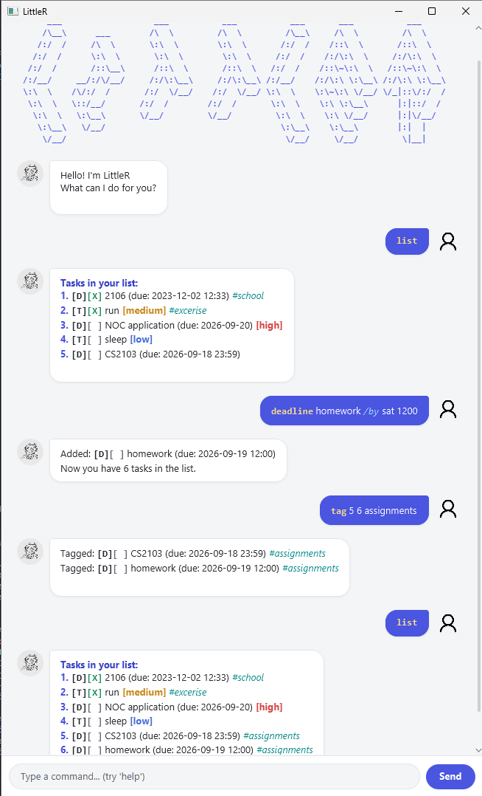

# LittleR User Guide

**LittleR** is a task manager chatbot with a chat-style GUI. Type commands to manage your to-dos,
deadlines, and events — with support for priorities, tags, sorting, and more.

---

## Quick Start

1. Ensure you have **Java 25** installed.
2. Download `LittleR.jar` from the [latest release](../../releases).
3. Open a terminal, navigate to the folder containing the JAR, and run: `java -jar LittleR.jar`
4. Type a command and press **Enter** or click **Send**.
5. Type `help` at any time to see all available commands in the app.

---

## Date & Time Formats

These formats are accepted wherever a date or datetime is required:

| Format               | Example                      | Notes                                                |
| -------------------- | ---------------------------- | ---------------------------------------------------- |
| `d-M-yyyy`         | `6-8-2026`                 | Day-Month-Year                                       |
| `yyyy-M-d`         | `2026-8-6`                 | Year-Month-Day                                       |
| Weekday abbreviation | `Mon`, `Tue`, `Wed` … | Resolves to the**next** occurrence of that day |

Append a 24-hour time (`HHmm`) to any date format to include a time: `6-8-2026 1400` → 6 Aug 2026, 2:00 PM

---

## Command Summary

Most commands have a **short form** shown in `[brackets]`. Both forms work identically.

| Command                                          | Short  | Description                               |
| ------------------------------------------------ | ------ | ----------------------------------------- |
| `list`                                         | `l`  | List all tasks                            |
| `todo <desc>`                                  | `t`  | Add a to-do                               |
| `deadline <desc> /by <datetime>`               | `dl` | Add a deadline                            |
| `event <desc> /from <datetime> /to <datetime>` | `ev` | Add an event                              |
| `mark <number(s)>`                             | `m`  | Mark one or more tasks as done            |
| `unmark <number(s)>`                           | `um` | Unmark one or more tasks                  |
| `delete <number(s)>`                           | `d`  | Delete one or more tasks                  |
| `find <keyword>`                               | `f`  | Search tasks by keyword                   |
| `on <date>`                                    | `o`  | List tasks on a specific date             |
| `sort /by <field> /order <a\|d>`                | `so` | View tasks sorted (non-destructive)       |
| `edit <number> [fields]`                       | `ed` | Edit one or more fields of a task         |
| `duplicate <number> [fields]`                  | `dp` | Copy a task, optionally overriding fields |
| `tag <number(s)> <tag>`                        | `tg` | Add a tag to one or more tasks            |
| `untag <number(s)> <tag>`                      | `ut` | Remove a tag from one or more tasks       |
| `priority <number(s)> <level>`                 | `p`  | Set priority on one or more tasks         |
| `archive`                                      | `a`  | Archive all tasks and start fresh         |
| `stats`                                        | `st` | View task list statistics                 |
| `undo`                                         | `un` | Undo the last change to the task list     |
| `help`                                         | `h`  | Show all commands                         |
| `bye`                                          | `b`  | Exit LittleR                              |

---

## Features

### Listing all tasks — `list`

Shows all tasks with their index numbers, type, status, priority, and tags.

Task type: `[T]` To-do · `[D]` Deadline · `[E]` Event
Status: `[X]` Done · `[ ]` Pending

---

### Adding tasks

#### To-do — `todo`

#### Deadline — `deadline`

#### Event — `event`

The start date/time must be strictly before the end date/time.

> LittleR will warn you if the task you are adding looks identical to one that already exists.

---

### Marking and unmarking — `mark` / `unmark`

Accepts one or more task numbers at once.

---

### Deleting tasks — `delete`

Accepts one or more task numbers. All indices are validated before any deletion occurs.

---

### Searching — `find`

Case-insensitive keyword search across all task descriptions, includes partial search.

---

### Listing tasks on a date — `on`

Shows deadlines due on that date and events occurring on that date.

---

### Setting priority — `priority`

Sets the priority level on one or more tasks at once.

| Level      | Shorthand |
| ---------- | --------- |
| `high`   | `1`     |
| `medium` | `2`     |
| `low`    | `3`     |

---

### Tagging — `tag` / `untag`

Adds or removes a tag from one or more tasks. Tags are stored in lowercase and display with a `#` prefix.

---

### Sorting — `sort`

Displays tasks in sorted order **without** changing the saved list.

| `/by` field | Sorts by                                            |
| ------------- | --------------------------------------------------- |
| `date`      | Due date / event start (tasks with no date go last) |
| `name`      | Description, alphabetically                         |
| `priority`  | Priority level (tasks with no priority go last)     |
| `tag`       | First tag alphabetically (untagged tasks go last)   |

`/order a` = ascending · `/order d` = descending

---

### Editing a task — `edit`

Updates one or more fields of an existing task. Only include the fields you want to change.

| Flag                        | Applies to     |
| --------------------------- | -------------- |
| `/name <new description>` | All task types |
| `/by <new datetime>`      | Deadlines only |
| `/from <new datetime>`    | Events only    |
| `/to <new datetime>`      | Events only    |

---

### Duplicating a task — `duplicate`

Creates a copy of an existing task (always starts unmarked), optionally overriding fields using the same flags as `edit`.

---

### Undoing the last change — `undo`

Reverts the most recent command that modified the task list (e.g. add, delete, mark, edit).
View-only commands (`list`, `find`, `sort`, `stats`) are not counted. Only one level of undo is supported.

---

### Viewing statistics — `stats`

Shows a breakdown of your task list by type, status, priority, and tags.

---

### Archiving — `archive`

Saves all current tasks to a backup file and clears the list so you can start fresh. The backup is stored alongside your data file.

---

### Getting help — `help`

Shows the full list of available commands and accepted date/time formats directly in the chat.

---

### Exiting — `bye`

Closes LittleR after a short delay.

---

### Data Storage

LittleR saves your tasks automatically to `./data/littler.txt` after every change — no manual saving needed. The file is created on first run if it does not exist.

> Do not edit the data file manually. Corrupted lines are skipped on load with a warning, but edits may cause data loss.
